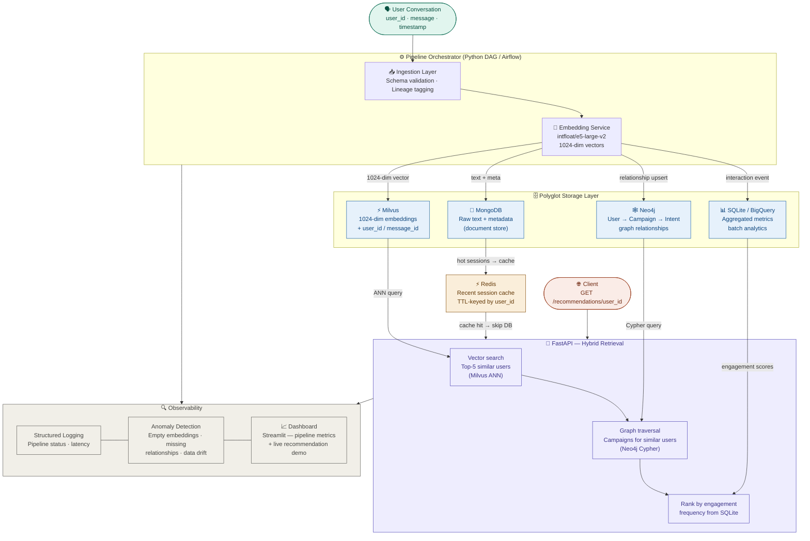
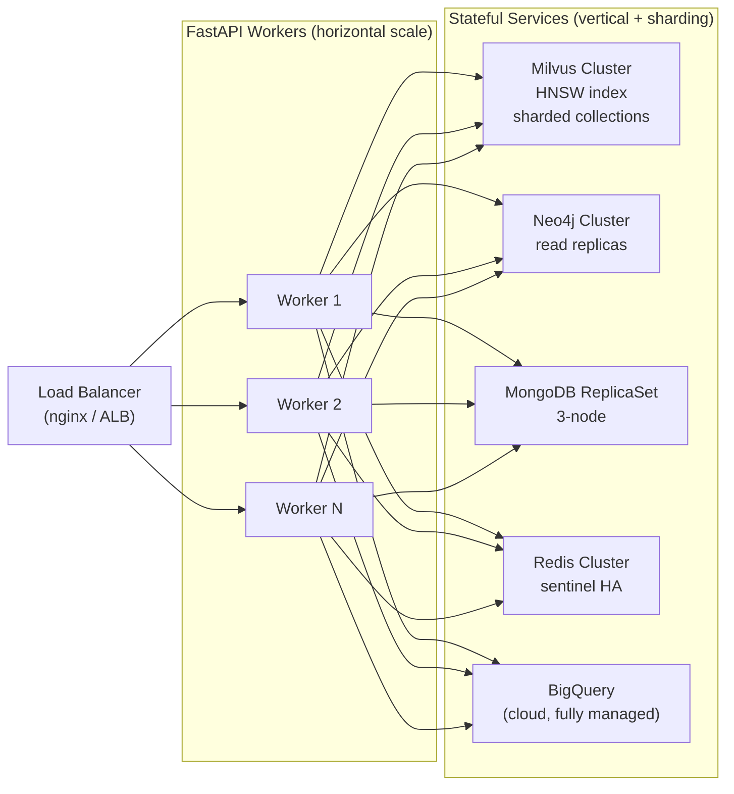

# Architecture Diagram — Scalable Multi-Database Data Platform

## System Overview



---

## Data Flow Summary

### Real-Time Path (per message, P99 < 500 ms)

```
User message
  → Ingestion (validate + tag lineage)
  → Embedding (intfloat/e5-large-v2 — 1024-dim)
  → MongoDB  (store raw text + metadata)
  → Milvus   (upsert 1024-dim vector)
  → Neo4j    (upsert user–campaign–intent edges)
  → Redis    (cache session for active user)
```

### Batch Path (scheduled, every N minutes)

```
MongoDB change-stream / polling
  → Aggregate interaction counts per user/campaign
  → Upsert aggregated rows → SQLite / BigQuery
  → Refresh Redis TTL for top-active users
```

### Query Path (API, target P99 < 200 ms)

```
GET /recommendations/<user_id>
  → Redis  → cache hit?  → return immediately (~2ms)
  → Milvus → ANN top-5 similar user embeddings
  → Neo4j  → campaigns connected to those 5 users
  → SQLite → rank campaigns by engagement frequency
  → merge + return JSON response
  → write result to Redis (TTL = 5 min)
```

---

## Component Interaction Matrix

| From \ To       | MongoDB | Milvus | Neo4j | SQLite | Redis | FastAPI |
|----------------|---------|--------|-------|--------|-------|---------|
| **Pipeline**    | write   | write  | write | write  | write | —       |
| **Redis**       | read    | —      | —     | —      | —     | serve   |
| **FastAPI**     | —       | read   | read  | read   | r/w   | —       |
| **Observability** | read  | —      | —     | read   | read  | read    |

---

## Scaling & Fault-Tolerance

